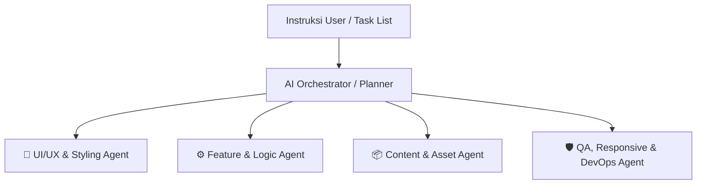

# 🤖 SUB-AGENT GOVERNANCE & ORCHESTRATION RULES
> **Pedoman & Aturan Pengelolaan Sub-Agent dalam Proyek `SIABE-PORTO`**  
> *Panduan untuk AI Orchestrator dan Pengembang dalam Mengelola, Menggabungkan (Merge), dan Mendeploy Sub-Agent secara Efisien & Komprehensif.*

---

## 📌 1. PRINSIP UTAMA (CORE PRINCIPLES)

1. **Reuse First (Gunakan yang Sudah Ada):**
   * Sebelum membuat Sub-Agent baru, **wajib mengecek** apakah tugas tersebut berada dalam domain / tanggung jawab Sub-Agent yang sudah ada atau pernah dibuat.
   * Jangan membuat Sub-Agent baru untuk tugas yang merupakan perbaikan (*bug fix*), revisi, atau kelanjutan dari Sub-Agent yang sudah pernah berjalan.

2. **Dynamic Provisioning (Buat Jika Belum Ada Class/Domain-nya):**
   * Jika suatu tugas membutuhkan keahlian, kelas, atau ruang lingkup (*domain scope*) baru yang **belum dicakup** oleh Sub-Agent yang ada (misal: *Security Scan*, *Database Migration*, *E2E Automated Testing*), buatlah Sub-Agent baru khusus untuk domain tersebut.

3. **Prevent Sub-Agent Bloat (Cegah Proliferasi Sub-Agent):**
   * **Dilarang** memecah tugas menjadi terlalu banyak Sub-Agent mikro untuk pengubahan-pengubahan kecil (seperti hanya mengubah 1 baris CSS atau mereset teks).
   * Semakin banyak Sub-Agent yang berjalan tanpa pengelompokan yang jelas, semakin tinggi risiko konflik kode (*race condition*) dan pemborosan *context window*.

4. **Proactive Merging & Consolidation (Saran Penggabungan Proaktif):**
   * AI Orchestrator **wajib menganalisis** seluruh daftar permintaan user.
   * Jika user memberikan banyak tugas sekaligus (misal: 6-10 tugas mikro), Orchestrator **harus memberikan saran ke user** untuk mengelompokkan/menggabungkan (*merge*) tugas-tugas serumpun menjadi **Sub-Agent Komprehensif**.

---

## 🧩 2. STRATEGI MERGER SUB-AGENT (COMPREHENSIVE AGENTS)

Untuk menjaga agar struktur Sub-Agent tetap komprehensif dan efisien, gabungkan tugas-tugas berdasarkan **Class / Domain** berikut:

### 📂 Matriks Pengelompokan (Domain Classification)

| Class / Domain Sub-Agent | Ruang Lingkup Tugas (Scope) | Contoh Tugas yang Digabung (Merged Tasks) |
| :--- | :--- | :--- |
| **`ui-ux-designer-agent`** | Layout, styling, CSS tokens, spacing, animasi, visual bugs. | • Fixing header overlap • Section margin & padding clearance • Theme & color system updates |
| **`feature-engineer-agent`** | JavaScript logic, DOM manipulation, state management, modal system, dynamic grids. | • Collaborate pricing tabs switcher • Featured projects modal popup • Dynamic filtering & data hydration |
| **`content-asset-agent`** | Copywriting, kontak CV, PDF resource integration, media asset management. | • Update contact info & CV details • Dedicated PDF download cards • Asset file organization & media linking |
| **`devops-qa-agent`** | Cross-device testing, git management, deployment sync, documentation. | • Mobile & tablet responsive audit • README & CHANGELOG sync • Git commit & Vercel live sync |

---

## 🚦 3. PROTOKOL ALUR KERJA ORCHESTRATOR (FLOWCHART KERJA)

Saat user memberikan instruksi bertingkat atau banyak daftar tugas sekaligus, Orchestrator harus mengikuti alur berikut:

1. **Step 1: Parse & Grouping**  
   Baca seluruh daftar instruksi user, petakan tugas ke dalam 4 *Class Domain* utama di atas.
2. **Step 2: Check Existing Agents**  
   Cek apakah ada Sub-Agent dari iterasi sebelumnya yang bisa dipakai kembali (*reuse*).
3. **Step 3: Propose Optimization / Merge (Jika Perlu)**  
   Jika user menyebutkan terlalu banyak Sub-Agent mikro (contoh: 10 Sub-Agent terpisah), berikan saran penggabungan ringkas:
   > *"Gua sarankan 10 tugas ini kita gabungkan menjadi 3 Sub-Agent Utama (UI/UX, Logic & Feature, dan DevOps/QA) agar pengerjaan lebih rapi dan cepat. Setuju?"*
4. **Step 4: Execute & Verify**  
   Jalankan pengerjaan per-domain, lakukan pengujian (*testing/verification*), dan update `CHANGELOG.md`.

---

## 📋 4. CHECKLIST PENILAIAN EFISIENSI SUB-AGENT

Sebelum menjalankan eksekusi, pastikan menyetujui checklist berikut:

- [ ] **Tidak ada duplikasi:** Apakah tugas ini sudah pernah ditangani Sub-Agent lain?
- [ ] **High Cohesion:** Apakah tugas-tugas dalam Sub-Agent ini menyentuh file/fitur yang saling berhubungan?
- [ ] **Low Coupling:** Apakah Sub-Agent ini tidak saling bertabrakan (*overlapping*) saat mengedit file yang sama?
- [ ] **Verifikabel:** Apakah hasil kerja Sub-Agent ini bisa diuji langsung (via browser/build/git)?

---

> **Catatan Dokumentasi:** File ini digunakan sebagai acuan baku (*Single Source of Truth*) oleh AI Orchestrator dan tim pengembang dalam setiap iterasi pengerjaan proyek `SIABE-PORTO`.
